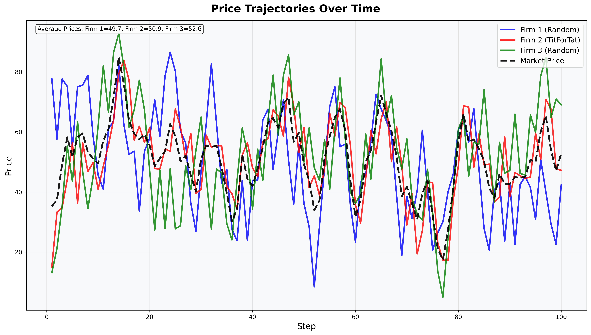

# Regulator: Market Competition & Collusion Detection

A comprehensive Python package for simulating market competition and detecting collusive behavior using advanced machine learning, LLM-based chat analysis, and sophisticated regulatory monitoring systems.

## Features

### Core Simulation
- **Market Simulation**: CartelEnv for oligopolistic price competition with dynamic demand elasticity
- **Agent Framework**: Multiple agent types (random, tit-for-tat, best response, adaptive learning, chat-enabled)
- **Chat Integration**: Natural language communication between firms with LLM-based monitoring
- **Economic Validation**: Built-in economic consistency checks and plausibility validation

### Detection Systems
- **Enhanced Regulator**: Graduated penalties, continuous risk scores, and market-aware monitoring
- **ML Detection**: Machine learning-based collusion detection using LightGBM and scikit-learn
- **LLM Detection**: OpenAI-powered natural language collusion detection
- **Rule-based Detection**: Traditional parallel pricing and structural break detection

### Advanced Features
- **Leniency Program**: Whistleblower dynamics and strategic reporting mechanisms
- **Adaptive Agents**: Learning agents that adapt strategies based on market conditions
- **Chat Agents**: Natural language communication with collusive and competitive message patterns
- **Economic Modeling**: Dynamic demand elasticity, capacity constraints, market entry/exit
- **Monitoring Dashboard**: Enhanced visualization with continuous risk scores and penalty tracking

### Development & Analysis
- **Comprehensive Logging**: Structured episode logging and analysis
- **Interactive Dashboard**: Streamlit-based visualization and analysis
- **CLI Interface**: Command-line tools for experiments and training
- **Modern tooling**: Black, Ruff, MyPy, Pytest with pre-commit hooks

## Quick Start

1. **Clone and setup**:
   ```bash
   git clone https://github.com/bangyen/regulator.git
   cd regulator
   make init
   ```

2. **Development workflow**:
   ```bash
   make fmt    # Format code
   make lint   # Lint code
   make type   # Type check
   make test   # Run tests
   make all    # Run all checks
   ```

3. **Set up environment variables** (for LLM detection):
   ```bash
   cp env.template .env
   # Edit .env and add your OpenAI API key
   ```

4. **Use the CLI**:
   ```bash
   # Run an experiment
   regulator experiment --steps 100 --firms "random,tit_for_tat"
   
   # Launch dashboard
   regulator dashboard
   ```

## Examples

### Episode Replay Visualization



*This episode replay shows price trajectories from an experiment with 3 firms (Random, TitForTat, Random) over 100 steps. The visualization displays how each firm's pricing strategy evolves over time, with the market price shown as a dashed line.*

### Enhanced Regulator with Graduated Penalties

```python
from src.agents.enhanced_regulator import EnhancedRegulator

# Create enhanced regulator with graduated penalties
regulator = EnhancedRegulator(
    use_graduated_penalties=True,
    use_market_awareness=True,
    cumulative_penalty_multiplier=1.2,
    market_volatility_threshold=0.3
)

# Monitor step with continuous risk scores
monitoring_result = regulator.monitor_step(prices, step, info)
print(f"Risk scores: {monitoring_result['risk_scores']}")
print(f"Penalty severity: {monitoring_result['penalty_severity']}")
```

### Machine Learning Detection

```python
from src.agents.ml_regulator import MLRegulator

# Create ML-enhanced regulator
ml_regulator = MLRegulator(
    use_ml_detection=True,
    ml_anomaly_threshold=0.1,
    ml_collusion_threshold=0.7,
    retrain_frequency=50
)

# Train ML models on historical data
ml_regulator.train_on_episodes(episode_logs)

# Monitor with ML detection
result = ml_regulator.monitor_step(prices, step, info)
```

### Leniency Program Experiments

```bash
# Run leniency experiment comparing with/without leniency
python scripts/leniency_experiment.py --episodes 50 --leniency-reduction 0.5
```

### Economic Validation

```python
from src.economic_validation import EconomicValidator

# Validate economic consistency
validator = EconomicValidator()
is_valid = validator.validate_step_data(step_data)
if not is_valid:
    print("Economic inconsistency detected!")
```

### Chat Agents and LLM Detection

Use chat-enabled agents with natural language communication and LLM-based collusion detection:

```python
from src.agents.chat_firm import CollusiveChatAgent, CompetitiveChatAgent, ChatMessageManager
from src.detectors.llm_detector import LLMDetector, ChatRegulator

# Create chat agents
collusive_agent = CollusiveChatAgent(agent_id=0, message_frequency=0.5)
competitive_agent = CompetitiveChatAgent(agent_id=1, message_frequency=0.3)

# Create message manager
manager = ChatMessageManager([collusive_agent, competitive_agent])

# Create LLM detector and regulator
detector = LLMDetector(model_type='llm', confidence_threshold=0.7)
chat_regulator = ChatRegulator(detector, message_fine_amount=25.0)

# Collect and monitor messages
messages = manager.collect_messages(step=1, observation=obs, env=env)
result = chat_regulator.monitor_messages(messages, step=1)
print(f"Messages analyzed: {result['messages_analyzed']}")
print(f"Collusive messages detected: {result['collusive_count']}")
```


### Episode Analysis

```bash
# Analyze episode data and messages
python scripts/analyze_episodes.py --view-messages --limit 10
```

## Project Structure

```
├── src/
│   ├── agents/              # Market agents (firms, regulators)
│   │   ├── enhanced_regulator.py    # Enhanced regulator with graduated penalties
│   │   ├── ml_regulator.py         # ML-enhanced regulator
│   │   ├── adaptive_agent.py       # Learning agents
│   │   ├── chat_firm.py           # Chat-enabled firm agents with natural language
│   │   ├── leniency.py            # Leniency program implementation
│   │   ├── regulator.py           # Base regulator implementation
│   │   └── firm_agents.py         # Various firm agent types
│   ├── cartel/              # Market environment
│   │   ├── cartel_env.py          # Main simulation environment
│   │   └── simplified_cartel_env.py
│   ├── detectors/            # Detection systems
│   │   ├── llm_detector.py        # LLM-based detection with chat monitoring
│   │   └── ml_detector.py         # ML-based detection
│   ├── monitoring/           # Monitoring and visualization
│   │   └── enhanced_dashboard.py  # Advanced monitoring dashboard
│   ├── episode_logging/      # Structured logging
│   ├── experiments/          # Experiment runners
│   ├── economic_validation.py # Economic consistency validation
│   └── regulator_cli.py      # CLI interface
├── scripts/                  # Core utility scripts
│   ├── run_experiment.py     # Episode and experiment runner
│   ├── leniency_experiment.py # Leniency program experiments
│   └── analyze_episodes.py   # Episode analysis utility
├── tests/                    # Comprehensive test suite
│   ├── unit/                 # Unit tests
│   └── integration/          # Integration tests
├── dashboard/                # Streamlit dashboard
├── logs/                     # Episode logs (gitignored)
├── Makefile                  # Development commands
└── pyproject.toml           # Package configuration
```

## Advanced Features

### Enhanced Regulator System
The enhanced regulator provides sophisticated monitoring with:
- **Graduated Penalties**: Different penalty levels based on violation severity
- **Continuous Risk Scores**: 0.0-1.0 risk scores instead of binary violations
- **Market Awareness**: Dynamic threshold adjustment based on market conditions
- **Cumulative Penalties**: Escalating penalties for repeat offenders

### Machine Learning Detection
ML-enhanced detection includes:
- **Anomaly Detection**: Isolation Forest for identifying unusual patterns
- **Collusion Classification**: Random Forest for classifying collusive behavior
- **Feature Engineering**: Statistical features from price patterns and market dynamics
- **Model Retraining**: Automatic model updates based on new data

### Leniency Program
Strategic whistleblower dynamics featuring:
- **Evidence-based Reporting**: Firms report collusion with evidence strength
- **Audit Threats**: Dynamic audit probability based on suspicion levels
- **Fine Reductions**: Configurable penalty reductions for cooperation
- **Strategic Timing**: Agents decide when to report based on risk assessment

### Chat Integration and Natural Language Processing
Advanced communication monitoring featuring:
- **Chat Agents**: Collusive and competitive message generation with configurable frequency
- **Message Management**: Centralized message collection and distribution system
- **LLM Monitoring**: Real-time analysis of natural language communications
- **Chat Regulator**: Specialized regulator for message-based collusion detection
- **Evidence Collection**: Message history and classification tracking for investigations

### Economic Validation
Built-in economic consistency checks:
- **Demand Curve Validation**: Ensures price-quantity relationships are consistent
- **Profit Margin Checks**: Validates profit calculations and market dynamics
- **Price Range Validation**: Ensures prices stay within economic bounds
- **Market Efficiency Metrics**: Tracks market performance indicators

## Customization

1. **Update package info** in `pyproject.toml`:
   - Change `name`, `description`, `authors`
   - Update repository URLs

2. **Configure regulators** in `src/agents/`:
   - Adjust penalty structures and thresholds
   - Modify ML model parameters
   - Customize leniency program settings

3. **Add new agent types** in `src/agents/firm_agents.py` or `src/agents/chat_firm.py`

4. **Extend detection methods** in `src/detectors/`

5. **Customize chat behavior** in `src/agents/chat_firm.py`:
   - Modify message templates and generation logic
   - Adjust message frequency and communication patterns
   - Add new chat agent types

6. **Write tests** in `tests/`

## License

MIT License - see LICENSE file for details.
