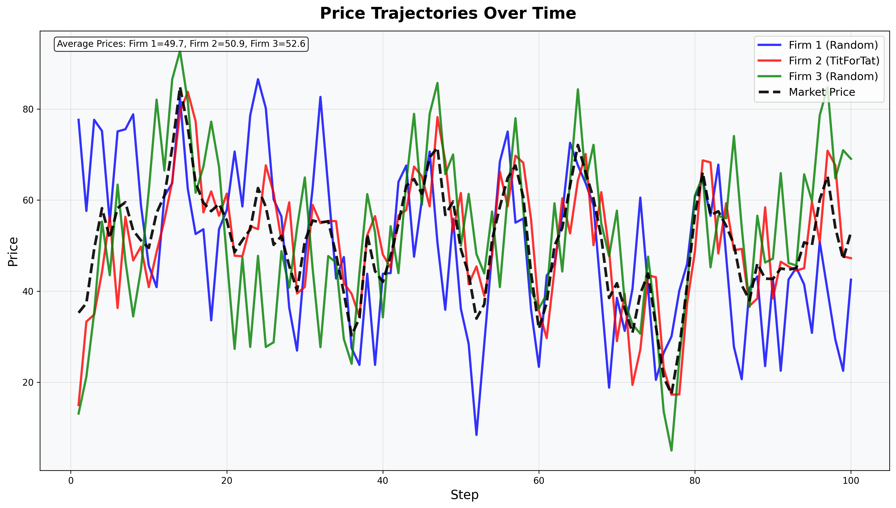

# Regulator

[](https://colab.research.google.com/github/bangyen/regulator/blob/main/regulator_demo.ipynb)
[](https://github.com/bangyen/regulator/actions/workflows/ci.yml)
[](LICENSE)

**Can a regulator detect algorithmic collusion from prices alone, without labeled cartels?**

This repo is a simulation testbed for that question. It simulates oligopoly
markets with competing firms, explicit and stealth cartels, and Q-learning
firms that learn to collude tacitly (as in Calvano et al. 2020). Standard
collusion *screens* are calibrated only on simulated competition, the
setting a regulator actually faces, and then measured on fresh markets.

<p align="center">
  
</p>

## Findings

`python scripts/screen_study.py` (or `regulator screen`): seed 0, 40 test
episodes per population, thresholds set for a 5% false-positive rate on
competitive simulations.

| Screen | best response (FPR) | noisy best response (FPR) | myopic Q-learning (FPR) | explicit cartel (detect) | stealth cartel (detect) | patient Q-learning (detect) | AUC |
|---|---|---|---|---|---|---|---|
| variance | 0% | 0% | 0% | 0% | 0% | 0% | 0.44 |
| rigidity | 0% | 0% | 0% | 0% | 0% | 0% | 0.53 |
| markup | 0% | 0% | 25% | 100% | 100% | 100% | 1.00 |
| parallel | 0% | 0% | 0% | 0% | 0% | 0% | 0.45 |
| retaliation | 0% | 0% | 22% | 0% | 0% | 8% | 0.63 |
| rule-based regulator (calibrated) | 0% | 0% | 0% | 0% | 0% | 0% | 0.44 |
| rule-based regulator (as shipped) | 100% | 100% | 100% | 100% | 100% | 50% | 0.44 |

Mean prices: best response 40.1, myopic Q-learning 44.5, patient Q-learning
47.0, stealth cartel 50.0, explicit cartel 55.0 (static Nash 40, monopoly 55).
Seeds 1–3 (6 Q-learning pairs per class) agree: markup AUC 1.00 with
5–25% false positives on myopic learners, retaliation AUC 0.63–0.69, and
the other behavioral screens 0.43–0.53.

What this shows:

1. **Q-learners collude without being told to.** Patient learners (discount
   0.95) settle at 47.0–47.7, about half-way from the Nash to the monopoly
   price. Myopic learners (discount 0) settle at 43.7–44.5.
2. **Behavioral screens fail here.** Variance, rigidity and parallel-pricing
   screens score at or below chance, because competitive best responders are
   just as stable and parallel as cartels.
3. **The structural markup screen works, if you know demand and costs.** It
   catches every cartel type, including tacit Q-learning collusion. But its
   false-positive rate on myopic learners (5–25%) exceeds the 5% target,
   because learned "competitive" prices vary from one pair to the next.
4. **Punish-and-return is a weak signal.** The retaliation screen picks up
   some patient learners (8–18%) but at a similar rate to myopic ones.
5. **The shipped rule-based regulator fines everyone.** It flags 100% of
   competitive markets, and fewer tacit colluders (50–65%) than competitors.

Caveats: one demand model (linear demand with logit shares), two firms,
100-step episodes, and a competitive null partly built from the same
learning algorithm as the colluders. The study is meant to be extended.
These are simulated results, not evidence about real markets.

## Quickstart

Clone the repo and run the demo:

```bash
git clone https://github.com/bangyen/regulator.git
cd regulator
pip install -e ".[dev,ml,dashboard]"   # ".[ml]" alone is enough to just run the demo
pytest   # optional: run tests
regulator screen          # the screening study (~1 min)
regulator experiment --firms stealth,stealth --regulator rule_based
```

Or open in Colab: [Colab Notebook](https://colab.research.google.com/github/bangyen/regulator/blob/main/regulator_demo.ipynb).

Compare line-ups and regulators across seeds (mean ± 95% CI per cell):

```bash
regulator batch --lineups "bestresponse,bestresponse;stealth,stealth" \
    --regulators none,rule_based,enhanced --seeds 10 --csv runs.csv
```

For real-time monitoring, run the dashboard:

```bash
python dashboard/main.py
# Or use the CLI: regulator dashboard
# Visit http://localhost:5000
```

The dashboard binds to `127.0.0.1` with debug off. Override with
`DASHBOARD_HOST`, `DASHBOARD_PORT` and `FLASK_DEBUG=1`. Never enable debug on a
network-reachable host, because the Werkzeug debugger allows arbitrary code
execution.

## Development Workflow

This project uses `uv` for dependency management and `just` as a task runner.

- **Initialize environment**: `just init`
- **Format code**: `just fmt`
- **Lint**: `just lint`
- **Type check**: `just type`
- **Run tests**: `just test`
- **Run all checks**: `just all`
- **Screening study**: `python scripts/screen_study.py`
- **Supervised benchmark**: `python scripts/benchmark.py`
- **Browser tests** (dashboard front end): `pip install -e ".[e2e]" && playwright install chromium && pytest -m e2e`

## Supervised detector benchmark

For contrast with the label-free screens: `python scripts/benchmark.py`
trains an episode classifier *with* labels (seed 42, ~45 s on 4 cores). A
regulator rarely has such labels, so read these as an upper bound.

| Detector | Accuracy | Precision | Recall | F1 | ROC AUC | Test size |
|----------|----------|-----------|--------|----|---------|-----------|
| ML (logistic) — baseline | 100.0% | 100.0% | 100.0% | 100.0% | 1.000 | 60 |
| ML (logistic) — noisy | 100.0% | 100.0% | 100.0% | 100.0% | 1.000 | 60 |
| ML (logistic) — mixed | 98.3% | 100.0% | 96.7% | 98.3% | 0.999 | 60 |
| ML (logistic) — adaptive | 31.7% | 35.1% | 43.3% | 38.8% | 0.371 | 60 |
| ML (logistic) — tacit (Q-learning) | 98.0% | 100.0% | 96.0% | 98.0% | 0.998 | 100 |

- **baseline** — fixed-price colluders vs random / best-response /
  tit-for-tat firms.
- **noisy** — comparable noise on both sides; colluders price 0–6 above the
  best-response level (~40).
- **mixed** — colluding pairs vs a colluder paired with a noisy competitor.
- **adaptive** — `AdaptiveAgent` pairs differing only in
  `collusion_tendency`; at chance, because the setting doesn't change prices
  over 50 steps.
- **tacit** — patient vs myopic Q-learning pairs; train and test use
  different trained pairs.

## Components

- **Market** (`cartel/`) — Gymnasium oligopoly with linear demand and logit
  market shares (default: Nash price 40, monopoly price 55).
- **Firms** (`agents/`) — best-response, tit-for-tat, random, explicit and
  stealth colluders, and Q-learning firms.
- **Screens** (`screens.py`) — variance, rigidity, markup, parallel pricing,
  punish-and-return; market benchmarks and null calibration.
- **Regulators** (`agents/`) — rule-based (parallel pricing, structural
  breaks), enhanced (graduated penalties), ML (rules plus an anomaly detector
  and a classifier trained offline on labeled simulations).
- **Experiments** (`experiments/`) — the screening study, single runs, batch
  runs with confidence intervals, Q-learning training; every run's log is
  checked for economic consistency.
- **Dashboard** (`dashboard/`) — run and inspect single experiments.

## Repo Structure

```plaintext
regulator/
├── regulator_demo.ipynb  # Colab notebook
├── dashboard/            # Flask dashboard (run with dashboard/main.py)
├── scripts/              # screen_study.py, benchmark.py, run_experiment.py
├── tests/                # Unit, integration and browser (e2e) tests
├── docs/                 # Images for README
└── src/regulator/
    ├── agents/           # Firms (incl. Q-learning) and regulators
    ├── cartel/           # Market environment
    ├── detectors/        # Supervised episode classifier and features
    ├── episode_logging/  # Logger & episode runner
    ├── experiments/      # Screening study, batch runs, training
    ├── screens.py        # Label-free collusion screens
    └── cli.py            # CLI entry point
```

## Validation

- ✅ 424 unit/integration tests (~93% coverage, 88% floor) + 11 browser tests
- ✅ Reproducible seeds for experiments
- ✅ Seeded studies: `scripts/screen_study.py`, `scripts/benchmark.py`
- ✅ Demo notebook executed in CI

## References

- [A Variance Screen for Collusion](https://doi.org/10.1016/j.ijindorg.2005.10.003) - Abrantes-Metz, Froeb, Geweke and Taylor (IJIO 2006); the variance screen

- [Artificial Intelligence, Algorithmic Pricing, and Collusion](https://www.aeaweb.org/articles?id=10.1257/aer.20190623) - Calvano et al. (AER 2020); the Q-learning setup used here
- [Algorithms, Machine Learning, and Collusion](https://academic.oup.com/jcle/article-abstract/14/4/568/5514023) - Comprehensive analysis of self-learning algorithms and collusive outcomes
- [Deep learning for detecting bid rigging](https://arxiv.org/abs/2104.11142) - CNN-based approach for flagging cartel participants using pairwise bidding interactions
- [Algorithmic Collusion: A Critical Review](https://arxiv.org/abs/2110.04740) - Critical assessment of pricing algorithms and collusion potential

## License

This project is licensed under the [MIT License](LICENSE).
