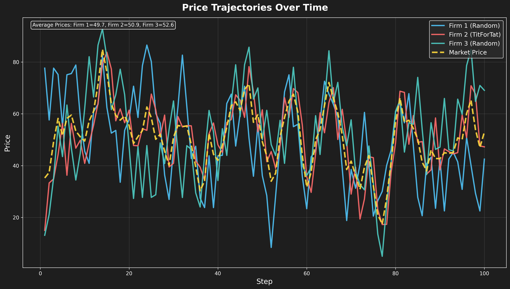

# Regulator

[](https://colab.research.google.com/github/bangyen/regulator/blob/main/regulator_demo.ipynb)
[](tests/)
[](LICENSE)

**Advanced Market Collusion Detection: 93% accuracy with ML+LLM detection, real-time monitoring, and economic validation**

<p align="center">
  
</p>

## Quickstart

Clone the repo and run the demo:

```bash
git clone https://github.com/bangyen/regulator.git
cd regulator
pip install -e .
pytest   # optional: run tests
python scripts/run_experiment.py --steps 100 --firms "random,tit_for_tat"
```

Or open in Colab: [Colab Notebook](https://colab.research.google.com/github/bangyen/regulator/blob/main/regulator_demo.ipynb).

## Results

| Detection Method | Accuracy | Precision | Recall | F1 Score | ROC AUC |
|------------------|----------|-----------|--------|----------|---------|
| ML Detector | **93.0%** | **85.0%** | **97.1%** | **90.7%** | **98.0%** |
| LLM Detector | 69.0% | 49.2% | 96.7% | 65.2% | 91.8% |

## Features

- **ML+LLM Detection** — 93% accuracy with sub-millisecond processing for real-time monitoring.
- **Economic Validation** — Built-in consistency checks and market dynamics validation.
- **Chat Integration** — Natural language communication monitoring with OpenAI-powered analysis.
- **Enhanced Regulator** — Graduated penalties, continuous risk scores, and market-aware monitoring.
- **Leniency Programs** — Strategic whistleblower dynamics and evidence-based reporting.

## Repo Structure

```plaintext
regulator/
├── regulator_demo.ipynb  # Colab notebook
├── scripts/              # Example run scripts
├── tests/                # Unit/integration tests
├── docs/                 # Images for README
└── src/                  # Core implementation
    ├── agents/           # Market agents (firms, regulators)
    ├── detectors/        # ML and LLM detection systems
    ├── cartel/           # Market simulation environment
    └── monitoring/       # Dashboard and visualization
```

## Validation

- ✅ Overall test coverage of 92% (`pytest`)
- ✅ Reproducible seeds for experiments
- ✅ Benchmark scripts included

## References

- [Algorithms, Machine Learning, and Collusion](https://academic.oup.com/jcle/article-abstract/14/4/568/5514023) - Comprehensive analysis of self-learning algorithms and collusive outcomes
- [Deep learning for detecting bid rigging](https://arxiv.org/abs/2104.11142) - CNN-based approach for flagging cartel participants using pairwise bidding interactions
- [Algorithmic Collusion: A Critical Review](https://arxiv.org/abs/2110.04740) - Critical assessment of pricing algorithms and collusion potential

## License

This project is licensed under the [MIT License](LICENSE).
